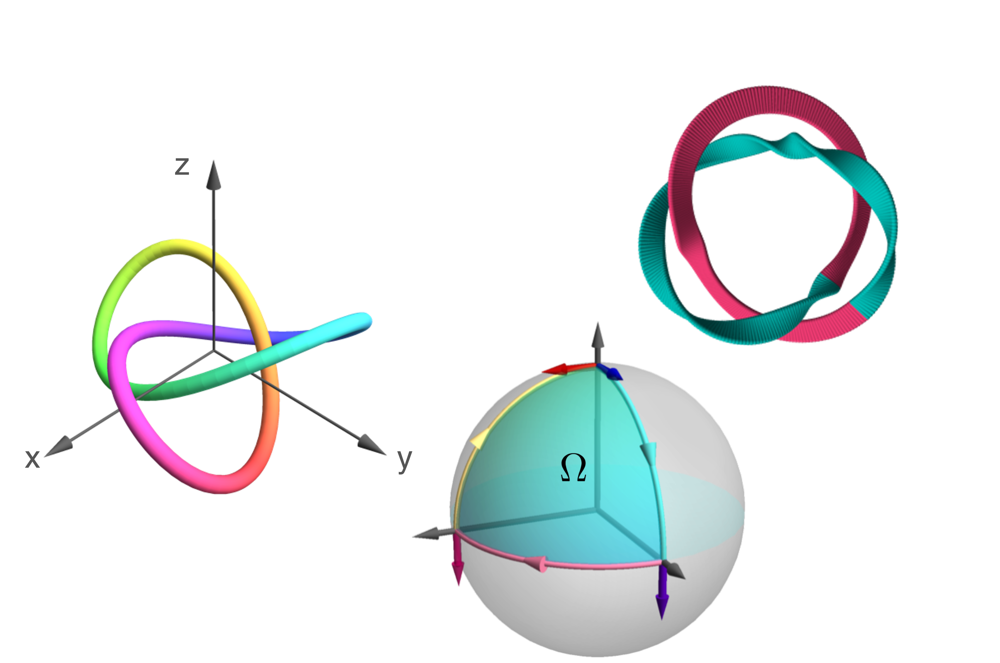
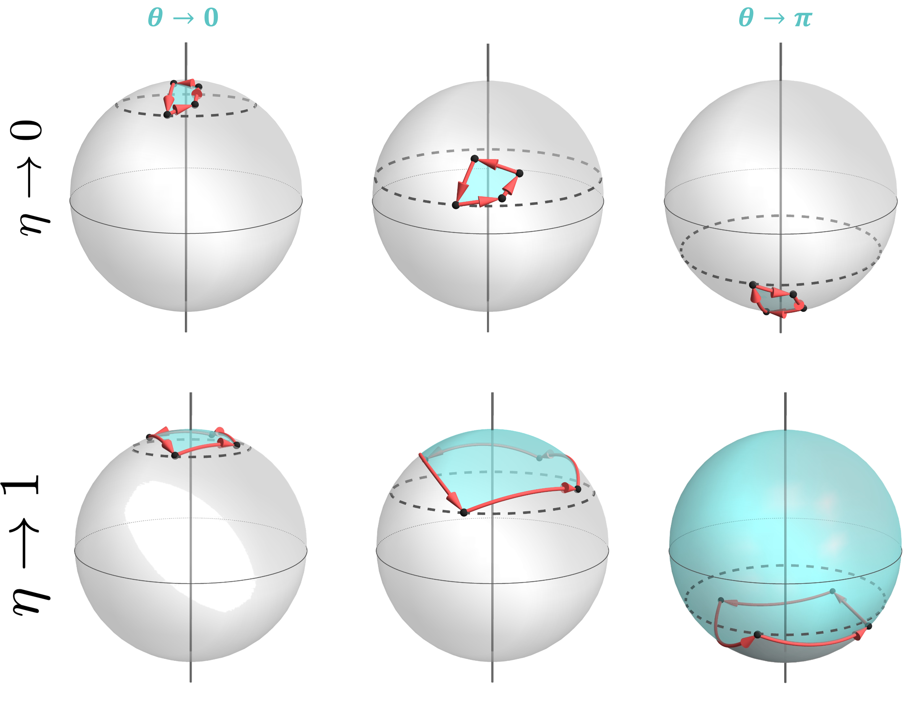

# My Scientific Publications

Below are my selected scientific publications. Each entry includes an image, the title (linked to the journal), and the abstract.

---

## 
[**Structuring Light: From Knots to Geometrical Optics**](([https://ruor.uottawa.ca/items/52c7e55e-765c-469c-86d4-c253824a86b5))  
_Abstract:_ Undoubtedly, light is one of the physical phenomena that has amazed humanity for millennia. In the past decades, rapid advances in technology have allowed us to study the hidden features of the electromagnetic field. Structured light – light beams whose intensity, phase profile, polarization, or frequency distribution has been tailored on demand – became a tool to explore the intersection between Maxwell’s equations and abstract mathematical concepts. The use of topology has become ubiquitous in photonics, such as the existence of caustics and optical systems that mimic the behavior of solid-state systems, among others. Here, physicists have taken advantage of quantities that stay unchanged under deformations, known as topological invariants, to obtain information regarding the nature of the system of interest.
In this work, I propose the use of structured light as a platform to explore the topological effects in different fields of optics. As our first attempt, we numerically explore the relationship between the dislocations carried by a structured field and the landscapes carved on a dispersive-absorptive substrate in the paraxial and nonparaxial regime. Inspired by the three-dimensional fields obtained by means of a high-numerical-aperture lens, we introduce a simple methodology to tie the tip of the electric field and generate knotted polarization states. In parallel, we propose the use of framed knots to encode and share information. In contrast to the non-trivial polarization states, these knots are obtained by tracking the spatial evolution of the singular points in the field along propagation. Finally, we study the nature of the time-independent acquired Pancharatnam-Berry phase as a function of the strength of a measurement. The results of these developments could have implications for current and future research to unveil new physics phenomena inspired by topology. The authors foresee advances in structuring non-paraxial light, exotic light-matter interactions, and optical metrology, among others.

---

## 
[**Topological transitions of the generalized Pancharatnam-Berry phase**]([https://www.science.org/doi/full/10.1126/sciadv.adg6810])  
_Abstract:_ Distinct from the dynamical phase, in a cyclic evolution, a system’s state may acquire an additional component, a.k.a. geometric phase. Recently, it has been demonstrated that geometric phases can be induced by a sequence of generalized measurements implemented on a single qubit. Furthermore, it has been predicted that these geometric phases may exhibit a topological transition as a function of the measurement strength. We demonstrate and study this transition experimentally by using an optical platform where the qubit is represented by the polarization of light and the weak measurement is performed by means of coupling with the spatial degree of freedom. Our protocol can be interpreted in terms of environment-induced geometric phases, whose values are topologically determined by the environment-system coupling strength. Our results show that the two limits of geometric phase induced by sequences of either weak or projective measurements are topologically distinct.

---

## 
[**Fast Adaptive Optics for High-Dimensional Quantum Communications in Turbulent Channels**]([https://arxiv.org/abs/2311.13041])  
_Abstract:_ Quantum Key Distribution (QKD) promises a provably secure method to transmit information from one party to another. Free-space QKD allows for this information to be sent over great distances and in places where fibre-based communications cannot be implemented, such as ground-satellite. The primary limiting factor for free-space links is the effect of atmospheric turbulence, which can result in significant error rates and increased losses in QKD channels. Here, we employ the use of a high-speed Adaptive Optics (AO) system to make real-time corrections to the wavefront distortions on spatial modes that are used for high-dimensional QKD in our turbulent channel. First, we demonstrate the effectiveness of the AO system in improving the coupling efficiency of a Gaussian mode that has propagated through turbulence. Through process tomography, we show that our system is capable of significantly reducing the crosstalk of spatial modes in the channel. Finally, we show that employing AO reduces the quantum dit error rate for a high-dimensional orbital angular momentum-based QKD protocol, allowing for secure communication in a channel where it would otherwise be impossible. These results are promising for establishing long-distance free-space QKD systems.

---

## 
[**Secure communication using low dimensional topological elements**]([https://arxiv.org/abs/2212.04350])
_Abstract:_ Low-dimensional topological objects, such as knots and braids, have become prevalent in multiple areas of physics, such as fluid dynamics, optics, and quantum information processing. Such objects also now play a role in cryptography, where a framed knot can store encoded information using its braid representation for communications purposes. The greater resilience of low-dimensional topological elements under deformations allows them to be employed as a reliable framework for information exchange. Here, we introduce a challenge-response protocol as an application of this construction for authentication. We provide illustrative examples of both procedures showing how framed links and braids may help to enhance secure communication.

---

## 
[**Polychromatic electric field knots**]([https://journals.aps.org/prresearch/abstract/10.1103/PhysRevResearch.3.033226])
_Abstract:_ The polarization of a monochromatic optical beam lies in a plane and, in general, is described by an ellipse, known as the polarization ellipse. The polarization ellipse in the tight-focusing (nonparaxial) regime forms nontrivial three-dimensional topologies, such as Möbius and ribbon strips as well as knots. The latter are formed when the dynamics of specifically structured polarization states are studied upon propagation. However, optical knots can also exist within another form: The electric field's tip can be made to locally oscillate along a knotted trajectory. We propose an intuitive technique to generate and engineer the path traced by the electric field vector of polychromatic beams to form different knots. In particular, we show examples of how tightly focused beams with at least three frequency components and different spatial modes can cause the tip of the electric field vector to follow, locally, a knotted trajectory. Our study may provide insight in designing current densities for structured polychromatic electromagnetic fields that interact with matter.

---

## 
[**Optical framed knots as information carriers**]([https://www.nature.com/articles/s41467-020-18792-z])
_Abstract:_ Modern beam shaping techniques have enabled the generation of optical fields displaying a wealth of structural features, which include three-dimensional topologies such as Möbius, ribbon strips and knots. However, unlike simpler types of structured light, the topological properties of these optical fields have hitherto remained more of a fundamental curiosity as opposed to a feature that can be applied in modern technologies. Due to their robustness against external perturbations, topological invariants in physical systems are increasingly being considered as a means to encode information. Hence, structured light with topological properties could potentially be used for such purposes. Here, we introduce the experimental realization of structures known as framed knots within optical polarization fields. We further develop a protocol in which the topological properties of framed knots are used in conjunction with prime factorization to encode information.

---

## 
[**Theoretical analysis on spatially structured beam induced mass transport in azo-polymer films**] ([https://opg.optica.org/oe/fulltext.cfm?uri=oe-28-14-19954&id=432852])
_Abstract:_ The radiation force from paraxial beams possessing helical phase fronts causes twists on the surface of an azobenzene polymer sample, and leads to the formation of micro-scale structures. Here, we theoretically investigate the radiation force generated by spatially structured optical beams on a dispersive-absorptive substrate. We derive an analytical expression for the radiation force from spatially structured polarized beams, including, lemon, star, monstar and vector vortex beams in the paraxial regime. Finally, we extend our calculation for non-paraxial beams - optical beams under the tight-focusing regime - and simulate the transverse radiation forces numerically at the focal plane.

---

## 
[**Newtonian orbits of nanoparticles interacting with structured light beams**]([https://iopscience.iop.org/article/10.1088/2040-8986/ab4f9a/meta])
_Abstract:_ We perform numerical analysis to study the orbits described by subwavelength-size particles interacting with complex structured light beams. Our solution to the particle dynamics considers: (i) the gradient force, (ii) the transverse radiation pressure, and (iii) polarisation-dependent curl force. The last two terms, (ii) and (iii), constitute the scattering forces. Multiples examples are provided to show the polarisation effects in the trajectories. For the single optical vortex case, the particle is always expelled due to the polarisation-dependent terms. Optical forces due to vector beams, such as cylindrical vector beams and full-Poincaré beams have been analysed finding closed and open orbits, respectively. Trapping control has been achieved by varying the separation distance in the off-axis superposition of optical vortices.

---

## 
[**Cylindrical vector beam generator using a two-element interferometer**]([://opg.optica.org/oe/fulltext.cfm?uri=oe-27-22-31810&id=422408])
_Abstract:_ We realize a robust and compact cylindrical vector beam generator that consists of a simple two-element interferometer composed of a beam displacer and a cube beamsplitter. The interferometer operates on the higher-order Poincaré sphere transforming a homogeneously polarized vortex into a cylindrical vector (CV) beam. We experimentally demonstrate the transformation of a single vortex beam into all the well-known CV beams and show the operations on the higher-order Poincaré sphere according to the control parameters. Our method offers an alternative to the Pancharatnam-Berry phase optical elements and has the potential to be implemented as a monolithic device.

---

## 
[**Generation of light beams with custom orbital angular momentum and tunable transverse intensity symmetries**]([ https://opg.optica.org/oe/fulltext.cfm?uri=oe-27-18-26155&id=417275])
_Abstract:_ UWe introduce a novel and simple modulation technique to tailor optical beams with a customized amount of orbital angular momentum (OAM). The technique is based on the modulation of the angular spectrum of a seed beam, which allows us to specify in an independent manner the value of OAM and the shape of the resulting beam transverse intensity. We experimentally demonstrate our method by arbitrarily shaping the radial and angular intensity distributions of Bessel and Laguerre-Gauss beams, while their OAM value remains constant. Our experimental results agree with the numerical and theoretical predictions.
